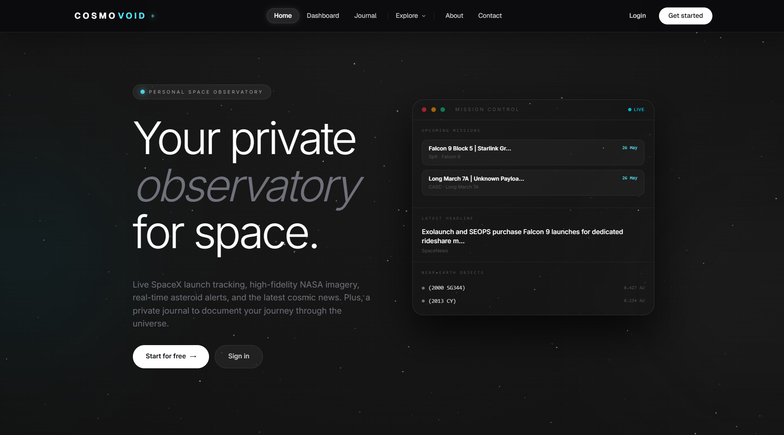
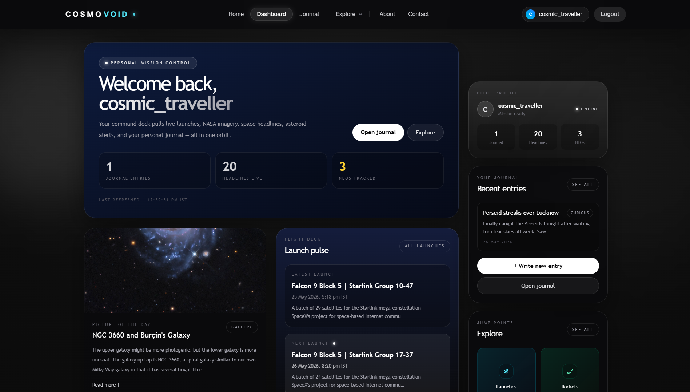
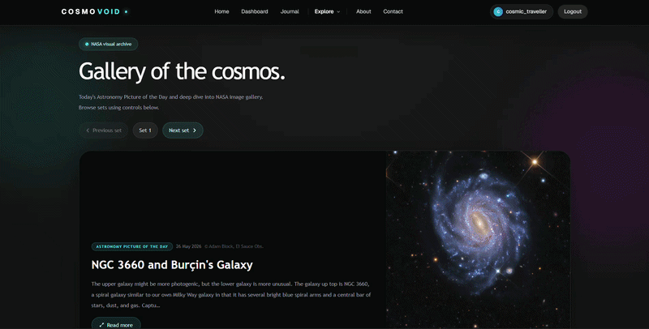
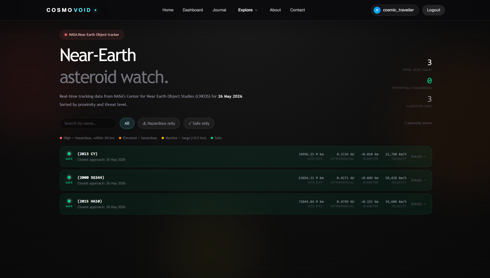
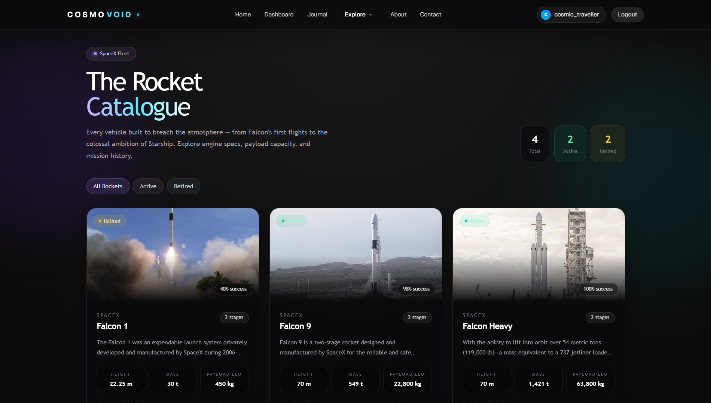
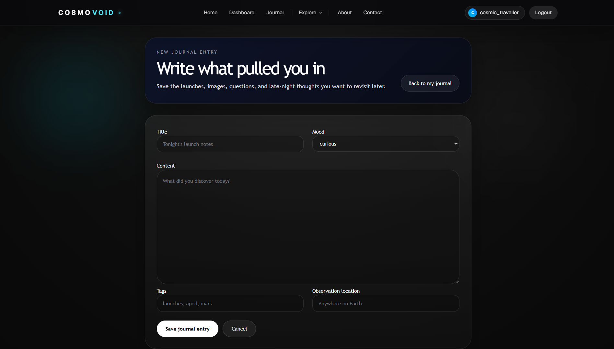
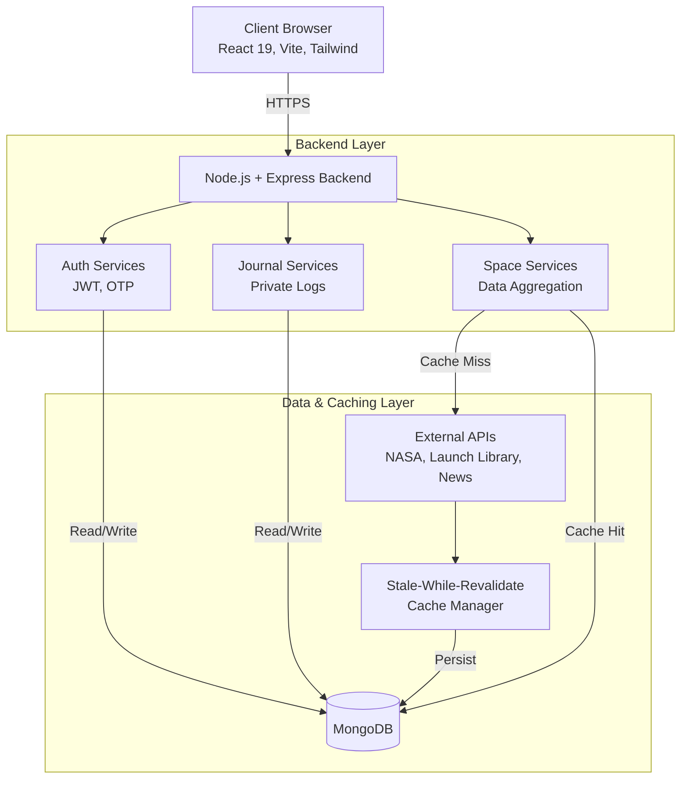

<div align="center">

<br/>

# COSMOVOID

**Your private observatory for everything beyond Earth.**

<br/>

[](https://nodejs.org)
[](https://react.dev)
[](https://mongoosejs.com)
[](https://expressjs.com)
[](https://vitejs.dev)

<br/>

> _Space is vast. Information about it shouldn't be._
> Cosmovoid pulls live launches, NASA imagery, asteroid alerts,
> space news, and your personal mission log into one focused interface.

<br/>

</div>

---

<br/>

## ❓ Why Cosmovoid?

<br/>

Space exploration data is notoriously fragmented. To stay updated, enthusiasts often juggle multiple platforms: one for launch schedules, another for NASA's daily images, a separate application for near-Earth object tracking, and disparate news aggregators for space-related updates.

**Cosmovoid** was built to solve this fragmentation by providing a unified, centralized command center for space enthusiasts, educators, and the casually curious.

By aggregating high-quality data from multiple reliable sources (like NASA, Spaceflight News, and the Launch Library), Cosmovoid offers a seamless, distraction-free environment. It strips away the noise, focusing purely on what matters: the cosmos. The application isn't just a dashboard; it's designed to be a personal observatory, complete with an auth-gated mission journal where users can log their celestial observations in a secure, private space.

<br/>

---

<br/>

## 📸 Interface & Visuals

<br/>

<div align="center">
  <table style="width:100%">
    <tr>
      <td align="center" width="50%">
        <b>Home / Landing Page</b><br/>
        
      </td>
      <td align="center" width="50%">
        <b>Mission Control Dashboard</b><br/>
        
      </td>
    </tr>
    <tr>
      <td align="center" width="50%">
        <b>NASA Deep Space Images</b><br/>
        
      </td>
      <td align="center" width="50%">
        <b>Asteroid Watch & NeoWs</b><br/>
        
      </td>
    </tr>
    <tr>
      <td align="center" width="50%">
        <b>Rocket & Launch Library</b><br/>
        
      </td>
      <td align="center" width="50%">
        <b>Personal Mission Journal</b><br/>
        
      </td>
    </tr>
  </table>
</div>

<br/>

---

<br/>

## ✦ Features

<br/>

### 🚀 Launch Tracking

Track upcoming and past orbital launches from every major space agency (SpaceX, NASA, ESA, Roscosmos, ISRO). View detailed mission profiles, rocket specifications, payloads, and launch pad data.

### 🌌 NASA APOD & Deep Space Image Library

Start your day with the **Astronomy Picture of the Day**, delivered fresh every 24 hours. Dive deeper into the cosmos by actively searching the vast NASA Image Library for high-resolution photos of galaxies, nebulae, and historical spaceflights.

### ☄️ Asteroid Watch

Monitor near-Earth objects (NEOs) making close approaches to Earth today. Get real-time metrics including estimated diameter, relative velocity, exact miss distance, and potential hazard classifications.

### 📡 Space News

Stay updated with the latest headlines and breakthroughs from across the space industry. News is aggregated in real-time and linked directly back to primary sources and publications.

### 👨‍🚀 Crew Explorer

Discover the humans exploring the cosmos. View active and historical astronauts ranked by their time in space, complete with detailed biographies, associated agencies, and full mission histories.

### 🛸 Rocket Library

Explore a comprehensive database of rocket configurations from multiple agencies. View intricate hardware specs, thrust capabilities, orbital capacities, and historical success rates.

### 🗒️ Mission Journal

A private, auth-gated space journal for logging your personal observations. Tag your entries with mood indicators, organize them with custom labels, and maintain a secure digital log of the night sky.

### 🖥️ Mission Control

Your personalized, dark-themed command deck. Get a bird's-eye view of all live feeds, recent news, upcoming events, and quick jump-points across the app—all on a single screen.

### 📅 Cosmic Events Tracker

Never miss a meteor shower again. A curated, interactive calendar of upcoming astronomical phenomena, including eclipses, planetary oppositions, solstices, and meteor showers.

### 🔐 Robust Account Security

Your data is locked down. The platform features fully secure JWT-based accounts with `HttpOnly` cookie storage, OTP-based password resets, safe profile management, and strict API rate-limiting to prevent abuse.

<br/>

---

<br/>

## ⚙️ Architecture

<br/>



<br/>

<details>
<summary><b>🗄️ &nbsp;Stale-While-Revalidate Cache</b></summary>
<br/>

External API responses live in MongoDB with two expiry windows:

- **Fresh window** — cached data is served as-is, no upstream call made
- **Stale window** — old data is returned instantly while a background refresh runs silently

An **in-memory layer** sits in front of MongoDB to cut round-trips further. Duplicate in-flight fetches for the same key are collapsed into a single request.

<br/>
</details>

<details>
<summary><b>🔐 &nbsp;JWT Auth via HttpOnly Cookies</b></summary>
<br/>

Sessions are signed tokens stored in `HttpOnly` cookies, keeping them out of JavaScript's reach entirely.

- Login accepts either **email** or **username**
- Protected routes (Dashboard, Journal) redirect unauthenticated visitors automatically

<br/>
</details>

<details>
<summary><b>🛡️ &nbsp;Rate Limiting & Input Validation</b></summary>
<br/>

- `/login` is rate-limited to **20 requests / 10 minutes** per IP
- All auth fields validated server-side via `express-validator` before touching the database

<br/>
</details>

<br/>

---

<br/>

## 🛠️ Tech Stack

<br/>

| Layer        | Technologies                                                      |
| :----------- | :---------------------------------------------------------------- |
| **Frontend** | React 19 · React Router 7 · Tailwind CSS 4 · Framer Motion · Vite |
| **Backend**  | Node.js · Express 5                                               |
| **Database** | MongoDB · Mongoose 9                                              |
| **Auth**     | JWT · bcryptjs · HttpOnly Cookies                                 |
| **Security** | Helmet · CORS · express-rate-limit · express-validator            |
| **APIs**     | Launch Library 2 · NASA APOD · NASA NeoWs · Spaceflight News      |

<br/>

---

<br/>

## 📁 Project Structure

<br/>

```
cosmovoid/
├── backend/
│   ├── app.js                  ← Express setup, middleware, routers
│   ├── server.js               ← Entry point
│   └── src/
│       ├── controller/         ← auth · journal · space
│       ├── middleware/         ← JWT verification
│       ├── models/             ← User · JournalEntry · ApiCache
│       ├── routes/             ← authRouter · journalRouter · spaceRouter
│       ├── services/           ← launchLibrary · nasa · news · spacex
│       └── utils/              ← staleCache · asyncHandler
└── frontend/
    └── src/
        ├── api/                ← Axios wrappers
        ├── components/         ← NavBar · Footer · ProtectedRoute
        ├── context/            ← Auth context + useAuth hook
        ├── layouts/            ← ExploreLayout
        ├── pages/              ← All views
        └── routes/             ← AppRouter
```

<br/>

---

<br/>

## 🚀 Getting Started

<br/>

### Prerequisites

- **Node.js** (v18 or higher)
- **MongoDB** (Local instance or MongoDB Atlas cluster)

### 1. Clone the Repository

```bash
git clone https://github.com/your-username/cosmovoid.git
cd cosmovoid
```

### 2. Install Dependencies

You need to install dependencies for both the frontend and backend.

```bash
# Install backend dependencies
cd backend
npm install

# Install frontend dependencies
cd ../frontend
npm install
```

### 3. Environment Variables

Create a `.env` file in the `backend` directory based on the `.env.example`.
Check the **Environment Variables** section below for the required fields.

### 4. Start the Application

Run both servers simultaneously.

**Backend Server:**

```bash
cd backend
npm start
# Server runs on http://localhost:5500 by default
```

**Frontend Dev Server:**

```bash
cd frontend
npm run dev
# Frontend runs on http://localhost:5173 by default
```

<br/>

---

<br/>

## 🌐 API Reference

<br/>

<details>
<summary><b>Auth &nbsp;—&nbsp; <code>/api/auth</code></b></summary>
<br/>

|  Method  | Endpoint           | Description                                     |
| :------: | :----------------- | :---------------------------------------------- |
|  `POST`  | `/signup`          | Create an account                               |
|  `POST`  | `/login`           | Log in _(rate-limited)_                         |
|  `POST`  | `/logout`          | Clear session cookie                            |
|  `GET`   | `/me`              | Get the current user                            |
|  `POST`  | `/send-otp`        | Send an OTP for password reset _(rate-limited)_ |
|  `POST`  | `/verify-otp`      | Verify the password reset OTP                   |
|  `POST`  | `/forgot-password` | Send a password reset link                      |
|  `POST`  | `/reset-password`  | Reset the user's password                       |
| `PATCH`  | `/profile`         | Update the user's profile                       |
| `DELETE` | `/account`         | Delete the user's account                       |

<br/>
</details>

<details>
<summary><b>Space &nbsp;—&nbsp; <code>/api/space</code></b></summary>
<br/>

| Method | Endpoint                    | Description               |
| :----: | :-------------------------- | :------------------------ |
| `GET`  | `/apod`                     | Today's NASA APOD         |
| `GET`  | `/asteroids`                | Near-Earth objects        |
| `GET`  | `/global/launches/upcoming` | Upcoming global launches  |
| `GET`  | `/global/launches/previous` | Past global launches      |
| `GET`  | `/global/launches/:id`      | Launch detail             |
| `GET`  | `/astronauts`               | Astronaut list            |
| `GET`  | `/astronauts/:id`           | Astronaut detail          |
| `GET`  | `/crew`                     | Active crew members       |
| `GET`  | `/crew/:id`                 | Crew detail               |
| `GET`  | `/news`                     | Space news feed           |
| `GET`  | `/rockets`                  | Rocket list               |
| `GET`  | `/rockets/:id`              | Rocket detail             |
| `GET`  | `/events/earth`             | NASA EONET events         |
| `GET`  | `/events/astronomy`         | External astronomy events |
| `GET`  | `/events/sky`               | Local curated sky events  |
| `GET`  | `/astronomy/token`          | Get astronomy API token   |
| `GET`  | `/media/search`             | Search NASA Image Library |

<br/>
</details>

<details>
<summary><b>Journal &nbsp;—&nbsp; <code>/api/journal</code> &nbsp;🔒 auth required</b></summary>
<br/>

|  Method  | Endpoint | Description                  |
| :------: | :------- | :--------------------------- |
|  `GET`   | `/`      | All entries for current user |
|  `POST`  | `/`      | Create a new entry           |
|  `GET`   | `/:id`   | Single entry                 |
|  `PUT`   | `/:id`   | Edit an entry                |
| `DELETE` | `/:id`   | Delete an entry              |

<br/>
</details>

<br/>

---

<br/>

## 🔑 Environment Variables

<br/>

| Variable               | Required | Notes                                 |
| :--------------------- | :------: | :------------------------------------ |
| `PORT`                 |    ✅    | Backend port — default `5500`         |
| `MONGO_URI`            |    ✅    | MongoDB connection string             |
| `JWT_SECRET`           |    ✅    | Should be long and randomly generated |
| `NASA_API_KEY`         |    ➖    | Falls back to `DEMO_KEY` if omitted   |
| `FRONTEND_URL`         |    ✅    | Vite dev port, used to configure CORS |
| `EMAIL_USER`           |    ➖    | SMTP user for sending OTPs            |
| `EMAIL_PASS`           |    ➖    | SMTP pass for sending OTPs            |
| `ASTRONOMY_API_ID`     |    ➖    | Astronomy API credentials             |
| `ASTRONOMY_API_SECRET` |    ➖    | Astronomy API credentials             |

<br/>

---

<br/>

## 🛰️ Roadmap

<br/>

| Status | Feature                     | Description                                       |
| :----: | :-------------------------- | :------------------------------------------------ |
|   ⬜   | **Live Launch Countdown**   | Real-time countdown timer on launch pages         |
|   ⬜   | **APOD Gallery Archive**    | Browse past APOD entries by date or keyword       |
|   ⬜   | **Earth Events Map**        | NASA EONET — wildfires, storms, volcanic activity |
|   ⬜   | **ISS Live Tracker**        | Real-time ISS position on a world map             |
|   ⬜   | **Notification System**     | Alerts for bookmarked upcoming launches           |
|   ⬜   | **Dark/Light Theme Toggle** | User-selectable theme, persisted to account       |
|   ⬜   | **Journal Export**          | Download entries as PDF or markdown               |

<br/>

---

<br/>

<div align="center">

_Built in the dark. Pointed at the stars._

</div>
